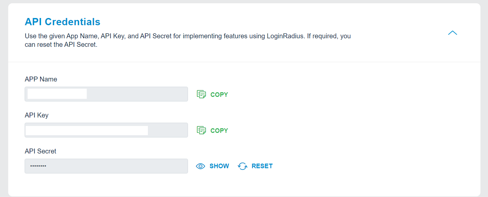
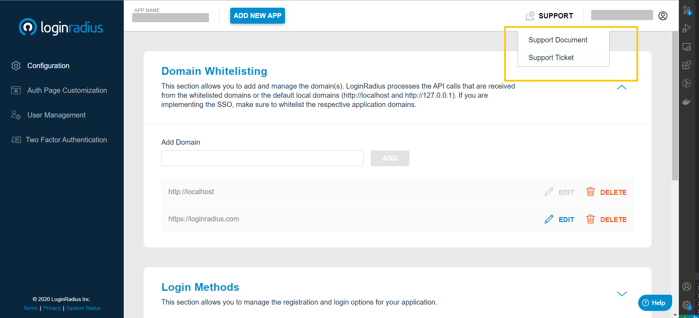

# Step-up Authentication
## Configure LoginRadius
Sign up to [LoginRadius Dashboard](https://accounts.loginradius.com/auth.aspx?return_url=https://adminconsole.loginradius.com/login&action=register)


## Get Your API Credentials

After signing up for LoginRadius, you can get all the required credentials to communicate with LoginRadius APIs.
Go through this document to get your API credentials from [LoginRadius Dashboard](https://www.loginradius.com/docs/developer/howto/dashboard-setup/)


API credentials are as below
- APP Name
- API Key
- API Secret



## Add demo project
Create a project under your tech stack folder. 
Use Existing Login/Register page and profile page available in the repository

**Note**: Get refrence from sample demo of LoginRadius IAM implementation using [Node.js and Express framework](/demos/nodejs/express/readme.md) under demos -> nodejs -> express.


Change Login page link with your IDX Login page link. The link will look like as below
```
<your app name>.hub.loginradius.com/auth.aspx?returun_url=”<your demo home page url>”
```

**NOTE: return _url would be the URL where you’ll be redirected after successful authentication**

After successful authentication on the IDX page, the user will be redirected to your given return page with the access token.
```
<localhost domain>?accesstoken=<Access Token>
```
## Utilize the access token as below

### Access token utilization
The token will be available in query param and can be utilized to get profile using our LoginRadius APIs as well as with available SDKs.


### Through SDKs
You can utilize our existing SDKs functions to handle access token

[Python](https://www.loginradius.com/docs/developer/sdk-libraries/python-library/)

[Node JS](https://www.loginradius.com/docs/developer/sdk-libraries/node-js-library)

[Golang](https://www.loginradius.com/docs/developer/sdk-libraries/golang-library/)

[PHP](https://www.loginradius.com/docs/developer/sdk-libraries/php-library/)

[JAVA](https://www.loginradius.com/docs/developer/sdk-libraries/java-library/)

[Ruby and Rails](https://www.loginradius.com/docs/developer/sdk-libraries/ruby-library/)

[ASP.Net](https://www.loginradius.com/docs/developer/sdk-libraries/asp-net-library/)

[HTML5](https://www.loginradius.com/docs/developer/sdk-libraries/html5-library/)

[Android](https://www.loginradius.com/docs/developer/mobile-sdk-libraries/android-library/)

[IOS](https://www.loginradius.com/docs/developer/mobile-sdk-libraries/ios-library/)

[React Native](https://www.loginradius.com/docs/developer/mobile-sdk-libraries/react-native-library/)

**Note: If your tech stack is not listed above, use our LoginRadius APIs to get/update profile using access token.**

### Through APIs

[Get Profile](https://www.loginradius.com/docs/developer/api/authentication#auth-read-all-profiles-by-token)

[Update Profile](https://www.loginradius.com/docs/developer/api/account-api#account-update)

## Raise Support Ticket

Stuck somewhere in implementation, Raise a support ticket. We'll be happy to help you.

