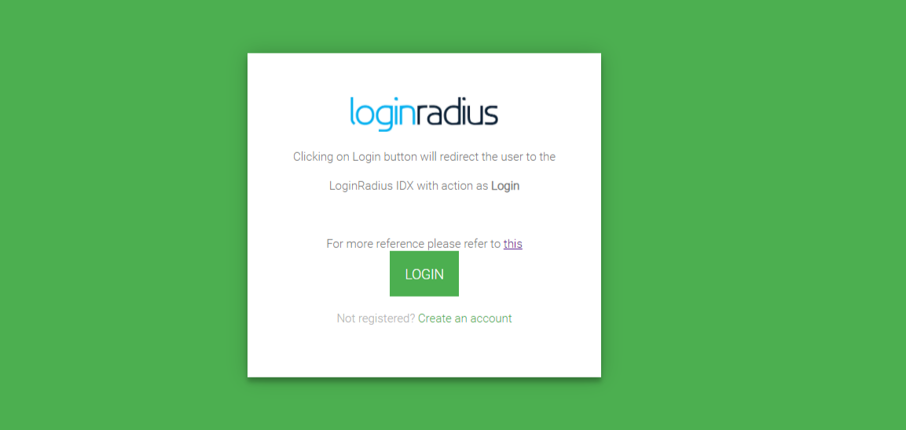
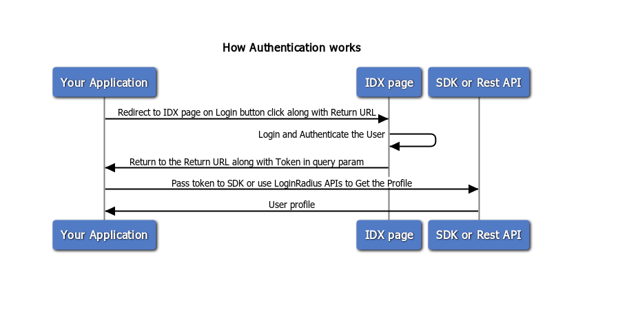

# Step-up Authentication

## Configure LoginRadius
Sign up to [LoginRadius Dashboard](https://accounts.loginradius.com/auth.aspx?return_url=https://adminconsole.loginradius.com/login&action=register)


## Get Your API Credentials

After signing up for LoginRadius, you can get all the required credentials to communicate with LoginRadius APIs.
Go through this document to get your API credentials from [LoginRadius Dashboard](https://www.loginradius.com/docs/developer/howto/dashboard-setup/)


API credentials are as below
- APP Name
- API Key
- API Secret


## Add demo project
Create a project under your tech stack folder. 
Use Existing Login/Register page and profile page available in the repository.

### Frontend

Check out the [Developer demo themes](/demos/theme/readme.md) for Folder structure and how to utilize and work with a token on client-side. 



```
theme/
  --|assets/
    |--|images/
    |----|lr-logo.png
    |--|scripts/
    |----|apiService.js
    |----|index.js
    |----|options.js
    |----|profile.js
    |----|theme.js
    |----|toast.js
    |----|utility.js
    |--|styles/
    |----loader.css
    |----theme.css
    |----toast.css
  --|index.html
  --|profile.html
  --|readme.md

```

### Backend

Get reference from sample demo of LoginRadius IAM implementation using [Node.js and Express framework](/demos/nodejs/express/readme.md) under demos -> nodejs -> express.


Change Login page link with your IDX Login page link. The link will look like as below.

```
<your app name>.hub.loginradius.com/auth.aspx?return_url=”<your demo home page url>”
```

**NOTE: return _url would be the URL where you will be redirected after successful authentication**

After successful authentication on the IDX page, the user will be redirected to your given return page with the access token.

```
<your demo home page url>?accesstoken=<Access Token>
```

## Utilize the access token as below

### Handling token

Look into this diagram to understand the Authentication flow and token handling.



In the above diagram:
- Your Application will redirect you to LoginRadius IDX page once you click on the Login Button.
- Login and Authenticate the User
- IDX page will return you to the `return_url` along with the token
- Utilize the token by using SDKs or APIs to get the profile.
- Display the User profile on the profile page in the frontend.


The token will be available in query param and utilize to get profile using our LoginRadius APIs as well as with available SDKs.


### Through SDKs
You can utilize our existing SDKs functions to handle the access token. Follow the list of available SDKs guidelines.

[Python](https://www.loginradius.com/docs/developer/sdk-libraries/python-library/)

[Node JS](https://www.loginradius.com/docs/developer/sdk-libraries/node-js-library)

[Golang](https://www.loginradius.com/docs/developer/sdk-libraries/golang-library/)

[PHP](https://www.loginradius.com/docs/developer/sdk-libraries/php-library/)

[JAVA](https://www.loginradius.com/docs/developer/sdk-libraries/java-library/)

[Ruby and Rails](https://www.loginradius.com/docs/developer/sdk-libraries/ruby-library/)

[ASP.Net](https://www.loginradius.com/docs/developer/sdk-libraries/asp-net-library/)

[HTML5](https://www.loginradius.com/docs/developer/sdk-libraries/html5-library/)

[Android](https://www.loginradius.com/docs/developer/mobile-sdk-libraries/android-library/)

[IOS](https://www.loginradius.com/docs/developer/mobile-sdk-libraries/ios-library/)

[React Native](https://www.loginradius.com/docs/developer/mobile-sdk-libraries/react-native-library/)

**Note: If your tech stack is not listed above, use our LoginRadius APIs to get/update profile using the access token.**

### Through APIs

[Get Profile](https://www.loginradius.com/docs/developer/api/authentication#auth-read-all-profiles-by-token)

[Update Profile](https://www.loginradius.com/docs/developer/api/account-api#account-update)

## Raise Support Ticket

Stuck somewhere in implementation, Raise a support ticket. We will be happy to help you.


## Video tutorial
Here is the [LoginRadius Authentication implementation](https://www.youtube.com/watch?v=efM46qNSaeg&t=315s) with your NodeJS App in 10 minutes.


## FAQs

1. How we are reading the users Access Token?

After a successful login from LoginRadius IDX, the access token is returned as the query parameter to the callback URL. Read Access token from the callback URL and store in the browser.


2. How logout is working if we do logout on IDX page?

After Logout action is performed on the IDX successfully, the user is redirected to the callback URL. On the callback page, we are checking if the access token is valid. If invalid, Access Token is removed from the localStorage and Cookies. 


3. How are we managing the Access Token on local and IDX?

Local: Access token is stored as "lr-session-token" in both cookie and localStorage. In this demo, to fetch the user's profile, access token is read from the localStorage and an ajax call is made to the LoginRadius Node.js SDK for user's profile.

IDX: Access token is stored as "lr-session-token" in the cookie.